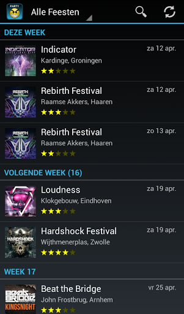
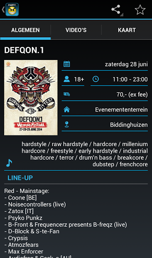

# Partyagenda - Harder Styles for Android

Partyagenda - Harder Styles provides an overview of all populair parties in the Harder Styles. It is the ideal party agenda for fans of hardstyle and hardcore. 

Music genres: hardstyle, hardcore, raw hardstyle, early hardcore, happy hardcore, early rave, frenchcore, jump & freestyle.

## Features
- All populair parties of the Harder Styles in one overview.
- Search on artist, music genre, city, etc.
- Add favorite parties to your personal agenda.
- Watch the trailer, aftermovie and other videos of a party.
- Buy tickets online through PayLogic, TicketScript, See Tickets, VakantieVeilingen.nl or another ticket provider.
- Book your bustrip to the party via Event Travel, Partybussen or another travel agency.
- View the party agenda offline. It is downloaded on your phone.

## Code release
Version 1.0 was released in 2012. This version was succeeded by version 2.0 in 2014. The project ended in February 2017 and the source code of the application was made publicly available with this event.
The source code is made available to provide code snippets for other Android developers. Bare in mind that this app targets Android 4.0.4 (API level 15). Some code may be outdated.

## Usage
### References
The source code contains certain references that should be changed. One of these references is the package name (nl.martijn.partyagenda). Another references is the URL of the webserver (content.partyagenda-app.nl).

### Server back-end
The Android application acquires information about future parties by downloading a file (data.json) from the webserver. This file is generated by a Content Management System (CMS) on the webserver. This CMS can be found in the [Partyagenda CMS](https://github.com/martijnkoopman/Partyagenda-CMS) github repository.

### Building
Import the source code (including the manifest) into an Android Studio project. Compile and run.

## License
This project is licensed under the Apache License 2.0 - see the [LICENSE](LICENSE) LICENSE.md file for details.
